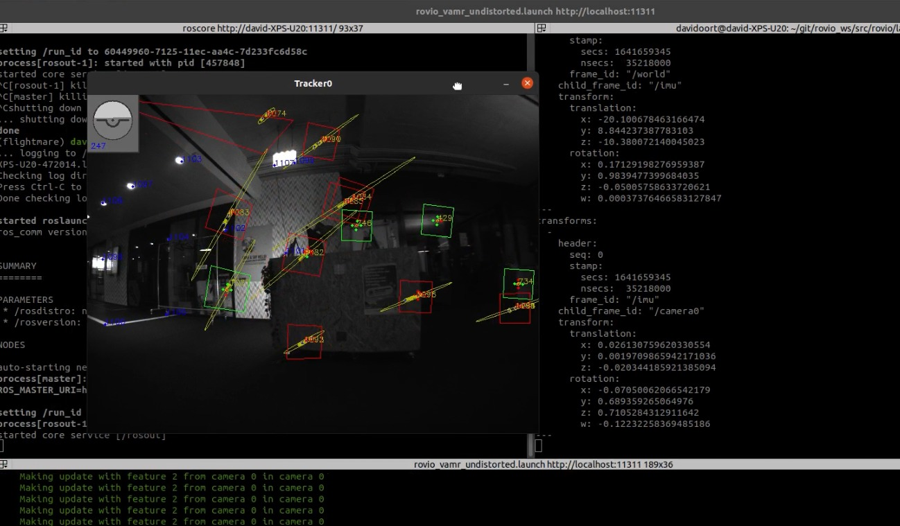

# Monocular visual-odometry (VO) project

##### Table of Contents
1. [Introduction](#intro)
2. [Running the pipeline](#runpipeline)
3. [Sample results](#results)
4. [Contributors](#contributors)
5. [License](#license)

<a name="intro"></a>
## Introduction
This repository contains a MATLAB implementation of a Monocular (single camera) Visual Odometry pipeline developed as part of the  (Vision Algorithms for Mobile Robotics)[http://rpg.ifi.uzh.ch/teaching.html] class at ETH Zürich. 

<a name="runpipeline"></a>
## Running the pipeline
### Requirements
The code has been developed and tested using MATLAB version 2020b and 2021b. 

In our pipeline, we have made use of the following built-in MATLAB functions/classes:
* triangulate (triangulation of landmarks)
* vision.PointTracker (KLT)
* lsqnonlin (trajectory alignment and BA)
* estimateWorldCameraPose (P3P + MSAC)
* estimateEssentialMatrix 

The following toolboxes are needed to use these functions:
* image_toolbox
* optimization_toolbox
* statistics_toolbox
* video_and_image_blockset


The screencasts that showcase some sample results [below](#results) have been recorded on a laptop with the following specs:
* Ubuntu 20.04
* Cores: 12
* CPU frequency: 2.6 GHz
* RAM: 16 GB

### Instructions
1. Clone this repository somewhere on your machine.
2. Download at least one of the datasets (KITTI, Malaga, Parking) from [here](http://rpg.ifi.uzh.ch/teaching.html) and place it inside a folder data which you should create at the root of this repository.
3. Open MATLAB and open `main.m`, make sure that the parameters at the top are correct:
```
ds = 0; % 0: KITTI, 1: Malaga, 2: parking
parking_path = 'data/parking';
kitti_path = 'data/kitti';
malaga_path = 'data/malaga-urban-dataset-extract-07';
```
4. Once you are ready, run `main.m`

<a name="results"><a/>
## Sample Results
<!-- Link to screencasts for provided datasets and for custom dataset as well, do so by creating a link from a screenshot of the CO figs -->
### Provided Datasets
#### KITTI
#### Malaga
#### Parking

### Custom (self-recorded) dataset

Our attempt at generating a validation (ground-truth) dataset using ROVIO can be found in [this fork](https://github.com/RobohouseHQ/rovio). Due to time constraints, we have not been able to improve on the out-of-the-box performance of ROVIO, which unfortunately had significant drift and could therefore not be used as ground truth. An example of ROVIO running on one of our custom Student Project House datasets can be found in the video below.

[](https://youtu.be/_WUWks9dkYk)

<a name="contributors"><a/>
## Contributors
### Authors
+ Patricia Apostol
+ Rayan Armani
+ David Oort Alonso
+ Max Martinez Ruts

<a name="license"><a/>
## License
This project is licensed under the MIT License. Check the [LICENSE](LICENSE) file for details.
